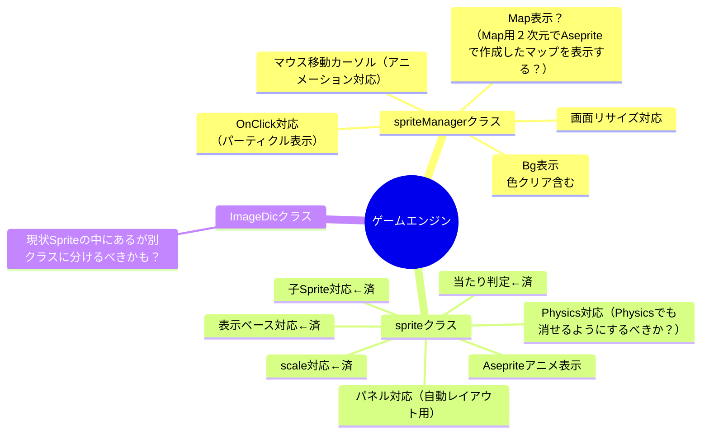

ゲームエンジンを作りたいと思ってあれこれやってみています

```mermaid
mindmap
top((ゲームエンジン))
    spriteManagerクラス
        OnClick対応<br>（パーティクル表示）
        マウス移動カーソル（アニメーション対応）
        Bg表示<br>色クリア含む
        Map表示？<br>（Map用２次元でAsepriteで作成したマップを表示する？）
        画面リサイズ対応
    spriteクラス
        scale対応←済
        表示ベース対応←済
        当たり判定←済
        Asepriteアニメ表示
        子Sprite対応←済
        パネル対応（自動レイアウト用）
        Physics対応（Physicsでも消せるようにするべきか？）
    ImageDicクラス
        現状Spriteの中にあるが別クラスに分けるべきかも？

```
