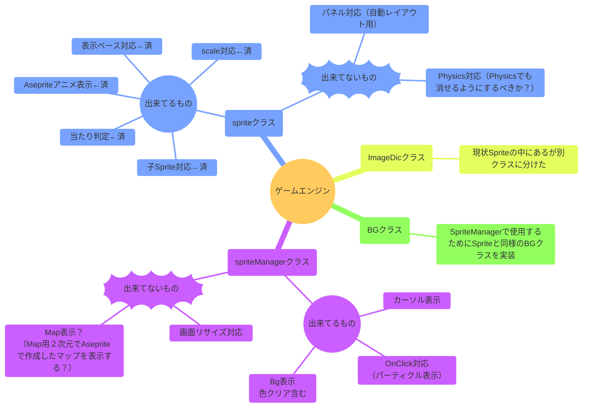

ゲームエンジンを作りたいと思ってあれこれやってみています

- 未実装分も含めた全体構想
- なんだか重なってしまうのが嫌いかも・・・

```mermaid
%%{init:{'theme':'base'}}%%

mindmap
top((ゲームエンジン))
    SpriteManager(spriteManagerクラス)
        Finished((出来てるもの))
            カーソル表示
            OnClick対応<br>（パーティクル表示）
            Bg表示<br>色クリア含む
        NotFinishd))出来てないもの((
            Map表示？<br>（Map用２次元でAsepriteで作成したマップを表示する？）
            画面リサイズ対応
    Sprite(spriteクラス)
        Finished((出来てるもの))
            scale対応←済
            表示ベース対応←済
            当たり判定←済
            Asepriteアニメ表示←済
            子Sprite対応←済
        NotFinishd))出来てないもの((
            パネル対応（自動レイアウト用）
            Physics対応（Physicsでも消せるようにするべきか？）
    ImageDic(ImageDicクラス)
        現状Spriteの中にあるが別クラスに分けた
    BG(BGクラス)
        SpriteManagerで使用するためにSpriteと同様のBGクラスを実装

```
