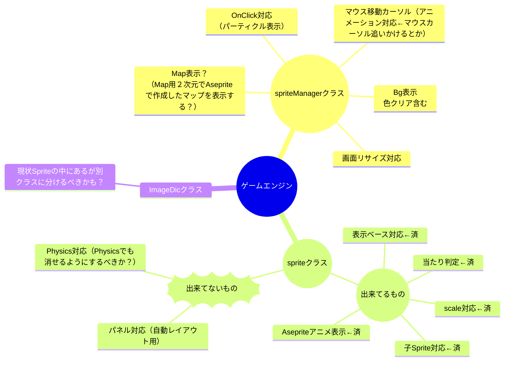

ゲームエンジンを作りたいと思ってあれこれやってみています

未実装分も含めた全体構想

```mermaid
mindmap
top((ゲームエンジン))
    ((spriteManagerクラス))
        OnClick対応<br>（パーティクル表示）
        マウス移動カーソル（アニメーション対応←マウスカーソル追いかけるとか）
        Bg表示<br>色クリア含む
        Map表示？<br>（Map用２次元でAsepriteで作成したマップを表示する？）
        画面リサイズ対応
    ((spriteクラス))
        ((出来てるもの))
            scale対応←済
            表示ベース対応←済
            当たり判定←済
            Asepriteアニメ表示←済
            子Sprite対応←済
        ))出来てないもの((
            パネル対応（自動レイアウト用）
            Physics対応（Physicsでも消せるようにするべきか？）
    ImageDicクラス
        現状Spriteの中にあるが別クラスに分けるべきかも？

```
